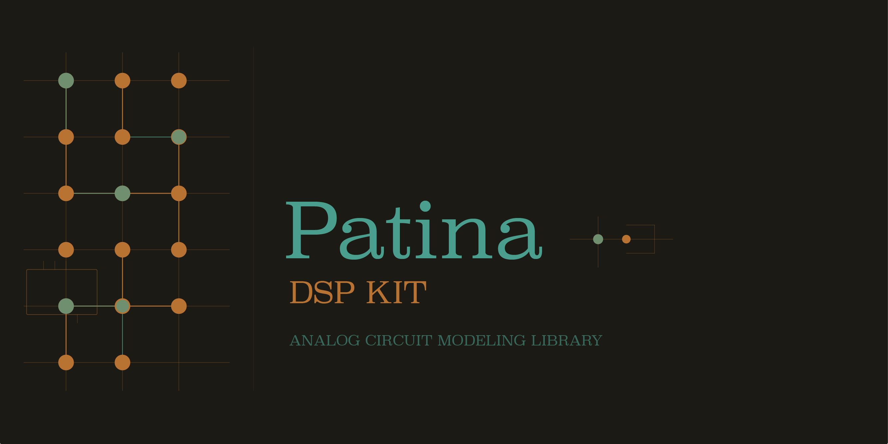
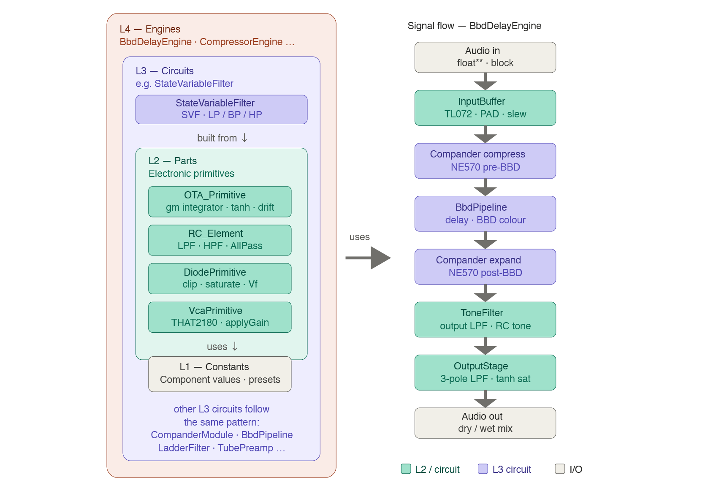

<!-- Header banner -->
<p align="center">
  
</p>

<!-- Badges -->
<p align="center">
  <a href="https://github.com/ShmKnd/Patina"></a>
  <a href="https://github.com/ShmKnd/Patina/blob/main/LICENSE"></a>
</p>

---

Patina is a general-purpose analog-modeling DSP library that emulates BBD delays, companders, tone circuits, tube amplifiers, and more — using **only the C++17 standard library**. No JUCE, no Boost, no external dependencies.

## Features

- **Zero external dependencies** — standard C++17 only
- **Header-centric** — nearly all logic lives in headers for maximum inlining
- **4-layer architecture** — Constants → Parts → Circuits → Engines with strict downward-only dependency
- **15 analog part primitives** — OTA, JFET, BJT, diode, vacuum tube, transformer, tape, photocell, RC element, op-amp, VCA, inductor, power pentode, vactrol, analog VCO
- **11 ready-to-use effect engines** — delay, drive, reverb, compressor, modulation, tape, channel strip, EQ, limiter, filter, envelope generator
- **Multi-channel** — stereo and arbitrary channel counts
- **Audio-thread safe** — RAII denormal suppression (FTZ/DAZ), NaN/Inf sanitization, zero-fill for excess channels

## Quick Start

### Header-only (no build system required)

```bash
g++ -std=c++17 -I/path/to/Patina -O2 -o myapp main.cpp
```

### CMake

```bash
mkdir build && cd build
cmake -DCMAKE_BUILD_TYPE=Release ..
make && sudo make install
```

Then in your project:

```cmake
find_package(Patina REQUIRED)
target_link_libraries(myapp PRIVATE Patina::Patina)
```

Or embed directly:

```cmake
add_subdirectory(Patina)
target_link_libraries(myapp PRIVATE Patina::Patina)
```

## Usage

```cpp
#include <patina.h>

// --- BBD Delay ---
patina::BbdDelayEngine delay;
delay.prepare({48000.0, 512, 2});

patina::BbdDelayEngine::Params p;
p.delayMs  = 300.0f;
p.feedback = 0.5f;
p.tone     = 0.6f;
p.mix      = 0.5f;
delay.processBlock(input, output, 2, numSamples, p);
```

```cpp
// --- Drive ---
patina::DriveEngine drive;
drive.prepare({48000.0, 512, 2});

patina::DriveEngine::Params p;
p.drive        = 0.7f;
p.clippingMode = 1;   // Diode
p.tone         = 0.6f;
drive.processBlock(input, output, 2, numSamples, p);
```

```cpp
// --- Compressor ---
patina::CompressorEngine comp;
comp.prepare({48000.0, 512, 2});

patina::CompressorEngine::Params p;
p.type      = patina::CompressorEngine::Fet;
p.inputGain = 0.7f;
p.ratio     = 2;
comp.processBlock(input, output, 2, numSamples, p);
```

```cpp
// --- Reverb ---
patina::ReverbEngine reverb;
reverb.prepare({48000.0, 512, 2});

patina::ReverbEngine::Params p;
p.type  = patina::ReverbEngine::Spring;
p.decay = 0.6f;
p.mix   = 0.3f;
reverb.processBlock(input, output, 2, numSamples, p);
```

See [docs/API_REFERENCE.md](docs/API_REFERENCE.md) for the full API, and `examples/` for complete working samples.

## Architecture

Patina models analog circuits in a strict **4-layer chain**:

```
L1  Constants   (dsp/constants/)   — Physical constants and IC specs
L2  Parts       (dsp/parts/)       — Semiconductor primitives (OTA, JFET, diode, tube, etc.)
L3  Circuits    (dsp/circuits/*/)  — Circuit modules (drive, filters, BBD, dynamics, etc.)
L4  Engines     (dsp/engine/)      — Integrated effect engines
```

Upper layers depend only on lower layers. No circular dependencies.

<!-- Insert architecture image -->
<p align="center">
  
</p>

### Part Primitives (L2)

Each primitive encapsulates real-device physics: temperature dependence, manufacturing tolerance, and nonlinearity.

| Primitive | Models | Presets |
|---|---|---|
| `OTA_Primitive` | Transconductance amplifier | `LM13700()`, `CA3080()` |
| `JFET_Primitive` | Junction FET | `N2N5457()`, `N2N3819()` |
| `BJT_Primitive` | Bipolar transistor | `Generic()`, `Matched()` |
| `DiodePrimitive` | Rectifier / clipping diode | `Si1N4148()`, `Schottky1N5818()`, `GeOA91()` |
| `TubeTriode` | Vacuum tube triode | `T12AX7()`, `T12AT7()`, `T12BH7()` |
| `TransformerPrimitive` | Audio transformer | `BritishConsole()`, `AmericanConsole()` |
| `TapePrimitive` | Magnetic tape | `HighSpeedDeck()`, `MasteringDeck()` |
| `PhotocellPrimitive` | Photocell (LDR + EL) | `T4B()`, `VTL5C3()` |
| `OpAmpPrimitive` | Op-amp IC | `TL072CP()`, `JRC4558D()`, `NE5532()`, `OPA2134()`, `LM4562()`, `LM741()` |
| `RC_Element` | Passive RC element | LPF / HPF / AllPass |
| `VcaPrimitive` | VCA cell | `THAT2180()` |
| `InductorPrimitive` | Inductor / coil presets | `HaloInductor()`, `WahInductor()` |
| `PowerPentode` | Power pentode tube model | `EL34()`, `6L6GC()` |
| `VactrolPrimitive` | Vactrol / opto-resistor element | `VactrolDefault()` |
| `AnalogVCO` | Voltage-controlled oscillator primitive | `Saw()`, `Triangle()` |

### Effect Engines (L4)

| Engine | Description |
|---|---|
| `BbdDelayEngine` | BBD analog delay with chorus modulation |
| `DriveEngine` | Diode clipper drive (Si / Schottky / Ge) |
| `ReverbEngine` | Spring and plate reverb |
| `CompressorEngine` | Opto / FET / variable-mu / VCA compressor |
| `ModulationEngine` | Phaser / tremolo / chorus |
| `TapeMachineEngine` | Tape saturation + transformer + wow & flutter |
| `ChannelStripEngine` | Console channel strip (preamp + EQ + transformer) |
| `EqEngine` | 3-band parametric EQ |
| `LimiterEngine` | FET / VCA / opto limiter |
| `FilterEngine` | Dual filter + triple drive |
| `EnvelopeGeneratorEngine` | ADSR envelope generator with VCA |

## Repository Structure

```
Patina/
├── dsp/
│   ├── core/          # Foundation (AudioCompat, ProcessSpec, FastMath, DenormalGuard)
│   ├── constants/     # L1: Domain-specific part constants
│   ├── parts/         # L2: Analog part primitives
│   ├── circuits/      # L3: Circuit modules
│   │   ├── bbd/       ├── compander/   ├── delay/      ├── drive/
│   │   ├── dynamics/  ├── filters/     ├── mixer/      ├── modulation/
│   │   ├── power/     └── saturation/
│   ├── engine/        # L4: Integrated effect engines
│   └── config/        # Cross-cutting: ModdingConfig, Presets
├── include/
│   └── patina.h       # Aggregate header
├── bindings/
│   ├── c/             # C API (opaque handle, 7 engines)
│   └── rust/          # Rust crate (patina-dsp)
├── examples/          # CUI samples — WAV output, no JUCE required
├── tests/             # Catch2 v3 (55+ test files)
├── cmake/
├── CMakeLists.txt
└── README.md
```

## Examples

Each example generates audio and writes a WAV file. **No JUCE required.**

```bash
cd examples
c++ -std=c++17 -O2 -I.. example_drive_engine.cpp -o example_drive
./example_drive   # → output_drive.wav
```

| File | Engine / Topic |
|---|---|
| `example_bbd_delay_engine.cpp` | BBD delay + chorus modulation |
| `example_channel_strip_engine.cpp` | Console channel strip (3 scenarios) |
| `example_compressor_engine.cpp` | Opto / FET / variable-mu / VCA comparison |
| `example_drive_engine.cpp` | Si / Schottky / Ge diode comparison |
| `example_envelope_generator.cpp` | ADSR envelope generator |
| `example_eq_engine.cpp` | Parametric EQ |
| `example_filter_engine.cpp` | Dual filter + drive |
| `example_limiter_engine.cpp` | Limiter |
| `example_modulation_engine.cpp` | Phaser / tremolo / chorus |
| `example_reverb_engine.cpp` | Spring & plate reverb comparison |
| `example_tape_machine_engine.cpp` | Tape speed + transformer saturation |
| `example_transient_gate.cpp` | Transient shaper / noise gate |
| `example_ringmod.cpp` | Ring modulator |
| `example_vco.cpp` | Analog VCO waveform generation |
| `example_vco_ringmod.cpp` | VCO + ring modulator |
| `example_wavefolder.cpp` | West Coast-style wave folder |
| `example_l1_constants.cpp` | L1 constants usage |
| `example_l2_parts.cpp` | L2 part primitives usage |
| `example_l3_circuits.cpp` | L3 circuit modules usage |

### Plugin Examples

For JUCE-based AU plugin examples showcasing each engine, see [Patina-Examples](https://github.com/ShmKnd/Patina-Examples).

## Language Bindings

### C API

```c
#include "patina_c.h"

PatinaDelayEngine engine = patina_delay_create();
PatinaProcessSpec spec = { 48000.0, 256, 2 };
patina_delay_prepare(engine, &spec);

PatinaDelayParams params = patina_delay_default_params();
params.delay_ms = 300.0f;
params.feedback = 0.5f;
patina_delay_process(engine, input, output, 2, 256, &params);

patina_delay_destroy(engine);
```

### Rust

```rust
use patina::{ProcessSpec, DriveEngine, DriveParams};

let mut engine = DriveEngine::new().unwrap();
engine.prepare(&ProcessSpec { sample_rate: 48000.0, max_block_size: 256, num_channels: 2 });

let params = DriveParams::default();
engine.process(&input, &mut output, &params);
```

## Tests

55+ test files powered by Catch2 v3:

```bash
mkdir build_tests && cd build_tests
cmake -DPATINA_BUILD_TESTS=ON ..
cmake --build . -j$(nproc)
./tests/Patina_tests
```

## Build Options

| Option | Default | Description |
|---|---|---|
| `PATINA_BUILD_STATIC_LIB` | `ON` | Build `libPatina.a` |
| `PATINA_BUILD_TESTS` | `OFF` | Build test suite |
| `PATINA_BUILD_C_BINDINGS` | `OFF` | Build C API (`libpatina_c`) |

## Requirements

- **C++17** or later
- GCC 7+, Clang 5+, MSVC 2017+ (v141)
- No external libraries required

## License

MIT

---

# 日本語

Patina は、BBD ディレイ・コンパンダー・トーン回路・真空管アンプなどのアナログ回路エミュレーションを、**標準 C++17 のみ**で提供する汎用アナログモデリング DSP ライブラリです。

## 主な特徴

- **外部依存ゼロ** — 標準 C++17 ライブラリのみ
- **ヘッダー主体** — ほぼ全ロジックがヘッダーに収まり、インライン最適化が効く
- **4 層アーキテクチャ** — 定数 (Constants) → 部品 (Parts) → 回路 (Circuits) → エンジン (Engines)
- **15 種のアナログ部品プリミティブ** — OTA / JFET / BJT / ダイオード / 真空管 / トランス / テープ / フォトセル / RC 素子 / オペアンプ / VCA / インダクタ / パワーペントード / バクトロール / アナログVCO
- **11 種の統合エフェクトエンジン** — ディレイ / ドライブ / リバーブ / コンプレッサー / モジュレーション / テープ / チャンネルストリップ / EQ / リミッター / フィルター / エンベロープジェネレーター
- **マルチチャンネル対応** — ステレオ・任意チャンネル数
- **オーディオスレッド安全** — RAII デノーマル抑制 (FTZ/DAZ)、NaN/Inf 伝播遮断

## クイックスタート

```bash
# ヘッダー直接利用（ビルドシステム不要）
g++ -std=c++17 -I/path/to/Patina -O2 -o myapp main.cpp

# CMake
mkdir build && cd build
cmake -DCMAKE_BUILD_TYPE=Release ..
make && sudo make install
```

詳細は [INSTALL.md](INSTALL.md) を参照してください。

## ドキュメント

- [API リファレンス](docs/API_REFERENCE.md) — 全モジュールの関数リファレンス
- [INSTALL.md](INSTALL.md) — インストール・ビルドガイド
- [CHANGELOG.md](CHANGELOG.md) — 変更履歴
- [Patina-Examples](https://github.com/ShmKnd/Patina-Examples) — JUCE プラグインサンプル集
