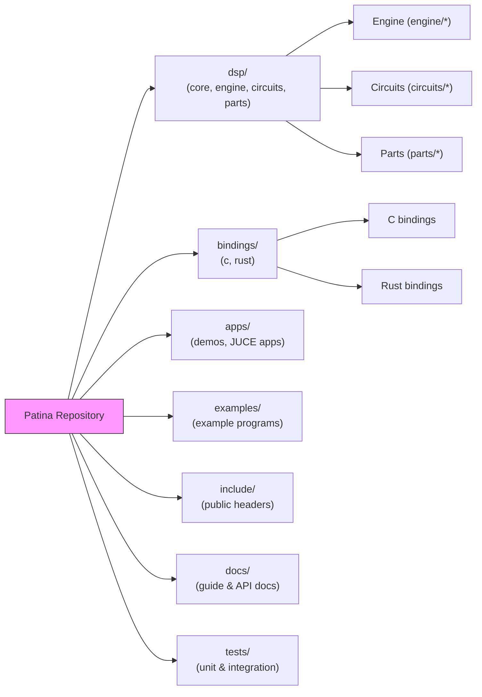

<!-- Architecture overview for the Patina repository -->
# Patina Architecture

This document provides a high-level architecture diagram of the Patina repository.

Notes:

- Keep `CHANGELOG.md` and other internal-only files in the private repository.
- This diagram is intentionally high-level; expand per-component diagrams where needed.
